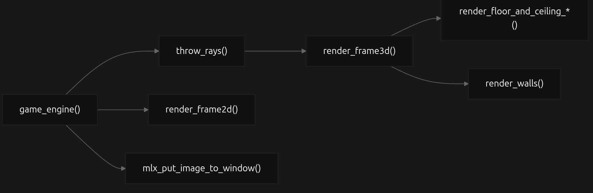
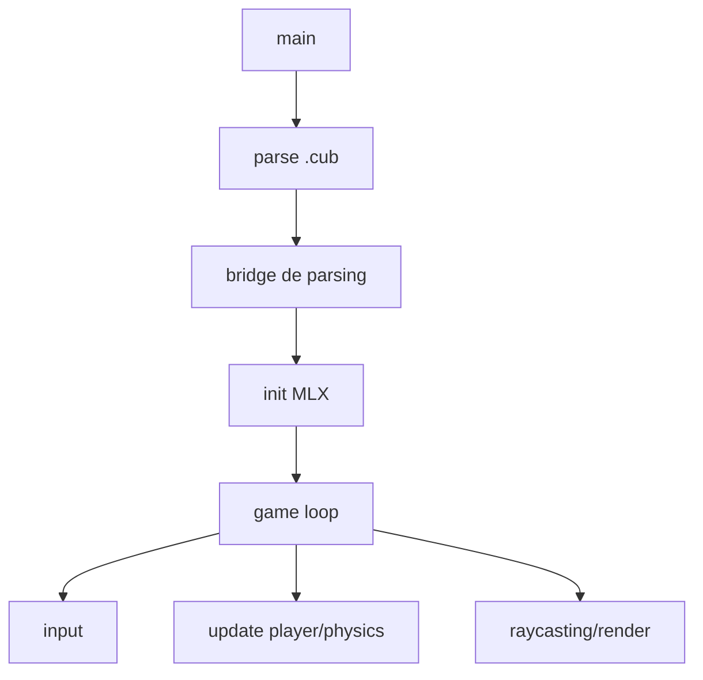

# cub3D

cub3D is a 3D graphics engine inspired by classic shooters like Wolfenstein 3D. This project introduces raycasting algorithms and real-time graphics programming, creating a dynamic 3D representation of a 2D maze from a first-person perspective using trigonometry, geometrics, and efficient rendering techniques.

## 🎮Demo

<!--  -->

## ✨ Our implementation

Our implementation prioritizes a **solid, highly configurable graphics engine** with a clean architecture that separates simulation from rendering, enabling real-time experimentation with rendering techniques and in-game configuration. We've integrated **performance optimizations** to maintain high FPS rates, and built an **advanced physics system**. This foundation allows seamless addition of new features—sprites, dynamic lighting, AI—without compromising performance.

## 🛠️ Core Features and technical highlights

### Parsing and Map Validation
- ✅ **Map validation** ensuring proper maze structure and player positioning
- 📄 Support for `.cub` file format with texture and color configuration
- 🧭 Player starting position and orientation detection (N/S/E/W)
- 🎨 Color parsing for floor and ceiling with RGB values

### Basic Requirements
- 🎯 **Real-time 3D rendering using raycasting** 
- 🎯 **DDA algorithm** for efficient ray-wall intersection calculations
- 🧱 **Textured walls** with support for different textures based on wall orientation (North, South, East, West)
- 🎨 **Customizable floor and ceiling colors**
- 🕹️ **Player movement** with WASD keys and sprint mode

### Bonus Features
- 🗺️ **Minimap display** for navigation assistance
- 🧱 **Wall collision detection** to prevent walking through walls and ensure realistic movement
- 🖱️ **Mouse look** clamped to prevent unnatural rotations and configurable sensitivity
- 🎥 **Pitch control** with up/down arrow keys and mouse vertical movement

### Graphics Engine and display features
- 🔄 **Toggle raycasting, textures, fish-eye correction, and distance mode**
- 🗺️ **Minimap with zoom and optional ray display** for better spatial awareness
- 🖱️ **Mouse control with sensitivity adjustment and toggle** for personalized experience
- 🎚️ **Adjust player volume**, enhancing immersion
- 🖥️ **Terminal info log** for all configuration changes, providing feedback on enabled/disabled features and current settings.


### Performance Enhancements and Architecture
- 🔄 **Configurable rendering modes** for performance
- 🖥️ **FPS display** and frame timing for performance monitoring
- ⚡ **Performance optimizations in base behavior** including operation reduction and local variable usage for stable, consistent frame rates
- 🏎️ **Boost mode** with low-level process and memory management enhancements (x2.5 FPS rate improvement)
- 🏛️ **Architecture with simulation and rendering separation**

### Physics System
- ⚙️ **Configurable Advanced physics system** for deterministic movement and interactions, independent of framerate
- 🎯 **2D plane acceleration and deceleration** with per-axis control
- 🪐 **Multiple gravity modes** (Ground, Moon, Jupiter, Spectre, Jetpack)
- 📍 **Jump direction preservation** and flight mode
- 🧍 **Crouch and prone position** support

### Visual Effects
- 🌫️ **Configurable Atmospheric effects** with fog and desaturation shaders featuring multiple modes
- 🧱 **Bonus textures for walls**
- 🎨 **Custom Maps and Textures** with personalized visual configurations and styling options


## Requirements

- Linux with X11 (Xlib, Xext, Xfixes) and zlib.
- `cc` and `make`.
- MiniLibX: a simple graphics library for window management and drawing, included as a submodule in this repository.
- Libft: self custom C library with utility functions, included in this repository.

## Installation

### Install dependencies (Ubuntu/Debian)

```bash
sudo apt-get update
sudo apt-get install gcc make xorg libxext-dev libbsd-dev libxfixes-dev
```

### Clone the Repository

```bash
git clone https://github.com/alcarril/cub3D.git
cd cub3D
git submodule update --init --recursive
```

### Clone with Submodules (Alternative)

```bash
git clone --recurse-submodules https://github.com/alcarril/cub3D.git
cd cub3D
```

## Build

```bash
make
```

## Usage

```bash
./cub3D assets/maps/good/self/performance.cub
```

# 🎮 Controls and Graphics Engine Configuration

Controls are handled through keyboard and mouse events captured by the X11 library via MiniLibX, allowing real-time configuration of the graphics engine, frame display, physics behavior, and overall gameplay experience. 


### Control Table

| Category | Key | Action |
|---|---|---|
| Movement & Camera | `W`, `A`, `S`, `D` | Move player |
| Movement & Camera | Arrow keys | Rotate camera / look up & down |
| Movement & Camera | `Left Shift` | Sprint |
| Movement & Camera | `Space` | Jump (physics enabled) |
| Movement & Camera | `Left Ctrl` | Crouch (physics enabled) |
| Movement & Camera | `Caps Lock` | Ground pound (physics enabled) |
| Movement & Camera | `Q` | Flight mode (physics enabled) |
| Graphics | `O` | Raycasting on/off |
| Graphics | `T` | Textures on/off |
| Graphics | `F` | Fish-eye correction on/off (textures off) |
| Graphics | `E` | Euclidean / perpendicular distance (textures off) |
| Graphics | `C` | Boost render mode |
| Display & Mouse | `M` | Minimap on/off |
| Display & Mouse | `R` | Rays on minimap on/off |
| Display & Mouse | `+` / `-` | Minimap zoom in / out |
| Display & Mouse | `J` | Mouse control on/off |
| Display & Mouse | Mouse wheel | Adjust mouse sensitivity |
| Display & Mouse | `,` / `.` | Decrease / increase player volume |
| Environment | `U` | Atmospheres on/off |
| Environment | `1` .. `4` | Select atmosphere |
| Physics | `P` | Physics system on/off |
| Physics | `K` | DukeDoom mode |
| Physics | `6` .. `0` | Gravity modes |

> **Note:** All controls can be viewed in the terminal, where a log is recorded when they are enabled or disabled.


## 🗾 ​Map parsing format

Map files must have a `.cub` extension and follow this structure:

```
NO textures/path/to/north_texture.xpm
SO textures/path/to/south_texture.xpm
WE textures/path/to/west_texture.xpm
EA textures/path/to/east_texture.xpm

F 220,100,0
C 225,30,0

111111111111
100000000001
100000S00001
111111111111
```

- **Texture paths**: NO (North), SO (South), WE (West), EA (East)
- **Floor color**: F R,G,B (RGB values 0-255)
- **Ceiling color**: C R,G,B (RGB values 0-255)  
- **Map grid**: 
  - `1`: Wall
  - `0`: Empty space
  - `N/S/E/W`: Player starting position and orientation


## 👁️​​🧱 ​​Raycasting and DDA

**Raycasting** is the **core rendering technique** used in this project, allowing us to create a **3D perspective from a 2D map** by casting rays from the player's position and calculating their intersections with walls. This method is **efficient for rendering simple 3D environments** and is the basis for many classic games like **Wolfenstein 3D** and **Doom**. It uses **mathematical concepts** such as **trigonometry and geometry** to determine how rays interact with the environment, enabling the engine to render **walls, floors, ceilings, and textures in real time**.

### ​DDA Algorithm

The **Digital Differential Analyzer (DDA)** algorithm is a method for calculating the intersection of rays with a grid-based map, which is **essential for raycasting**.This allows the engine to efficiently determine where rays hit walls and how to render them on screen, making it a **fundamental part of the raycasting process**.

- **Grid-based only**: Works exclusively in **discrete and Euclidean spaces**; not suitable for continuous or complex geometries.
- **Efficient complexity**: Reduces complexity to **O(1) per step**, though total steps can be high for large maps or long walls—**without precision loss**.
- **Multi-step process**: Consists of several sequential steps to trace the ray through the grid.

### Fish-eye correction and distance calculations

When textures are disabled, the engine can switch between **Euclidean distance** (straight-line distance from player to wall) and **perpendicular distance** (distance along the ray's path). The latter is used for **fish-eye correction**, which eliminates distortion by ensuring that walls appear straight regardless of the viewing angle, providing a more realistic perspective.

> **Note:** 📝 More on raycasting, DDA, and fish-eye correction: [ Our Notion article](https://broken-snowdrop-f03.notion.site/Raycasting-y-DDA-algorithm-2f9b80eb3d8880f4b86ae04ee0229cde).

## 🔥 Boost mode implementation

When boost mode is enabled, low-level optimizations are applied to critical render loops and buffer filling operations, achieving **performance improvements of up to 2.5x in frame rate**. 

### What are hot loops and low-level optimizations?

When rendering an image, there are certain functions that are called **once per pixel**. For example, in a window of **1280 × 720 pixels**, a function would be called around **900,000 times per frame**. These highly-repeated loops are called **hot loops**.

Hot loops are loops that execute millions of times per second in performance-critical code across **graphics engines**, **real-time simulations**, **physics**, **machine learning**, and **data processing systems**. Because they run so frequently, every CPU cycle counts, small inefficiencies drastically reduce performance and optimizing hot loops is essential for achieving high FPS rates in realtime applications.


### ❌ Things to Avoid in hot loops

| Optimization | Description |
|--------------|-------------|
| **Pointer indirections** | Causes cache misses, breaks prefetching, increases RAM latency |
| **Frequent cache misses** | Reduce throughput, fill pipelines with NOPs, cause stalls |
| **`if` statements in hot loops** | Unpredictable branches can hurt branch prediction and pipeline efficiency; deterministic input may still be OK |
| **Function pointers** | Increase call overhead and cache misses; worse than deterministic `if`s |
| **Misaligned multiplications** | Misaligned memory accesses → inefficient, more cache misses, reduces vectorization |
| **Function calls** | Stack/register overhead, breaks pipeline optimization, reduces vectorization |
| **Calls saturating the I-cache** | Many scattered instructions → lower throughput, I-cache pressure |
| **Heavy divisions and multiplications** | Slow operations → may stall hot loops |


### ✅ Things to Encourage in hot loops

| Optimization | Description |
|--------------|-------------|
| **Memory alignment** | Enables contiguous and predictable access, reduces cache misses, supports SIMD and vectorization |
| **Contiguous memory / Struct of Arrays (SoA)** | Facilitates prefetching, efficient cache line loading, enables SIMD and vectorization |
| **Prefetching** | Brings data into cache ahead of time, keeps pipeline full, supports vectorization and SIMD |
| **SIMD** | Processes multiple data elements per instruction, increases throughput, requires aligned and contiguous data |
| **Vectorization** | Converts scalar operations into block operations, depends on alignment, contiguity, and prefetching |
| **Loop unrolling** | Reduces loop control overhead, allows SIMD/vectorization to be more effective |
| **Use of registers and local variables** | Reduces memory accesses, keeps data close to the CPU, accelerates hot loops and vectorization |
| **Microprocessor performance improvements** | Takes advantage of modern CPU enhancements like larger caches, better branch prediction, higher clock speeds, and SIMD/vector units |

> **Note:** 📝 More on CPU: [Our Notion article](https://broken-snowdrop-f03.notion.site/Microprocesador-CPU-2fbb80eb3d8880768146c87d1607167d?pvs=74).

> **Note:** 📝 More on processor optimizations: [Our Notion article](https://broken-snowdrop-f03.notion.site/Pr-cticas-para-optimizar-el-uso-de-procesador-en-hoot-lopps-2fdb80eb3d888095948ee1b523863e2d).


### Memory Fill Optimizations
Instead of writing memory byte-by-byte, this implementation fills memory using **larger aligned blocks** that match cache lines and pages, allowing modern CPUs to write much faster. By **aligning the destination pointer**, **expanding the fill value** into larger patterns, and writing progressively smaller blocks only when needed, this approach reduces write operations and improves CPU and cache efficiency.

> **Note:** 📝 More on Memory Fill: [Our Notion article](https://broken-snowdrop-f03.notion.site/Mejoras-de-bufferizacion-2fdb80eb3d8880d08f50d5f284dd28c8?pvs=74).

| Optimization | Description |
| --- | --- |
| **Memory alignment** | Aligns the destination pointer to 64-byte cache line boundaries to avoid unaligned writes and cache penalties. |
| **Pattern expansion** | Expands the input `int` value into `long` and `long long` patterns to write multiple bytes per instruction. |
| **Large block writes** | Fills memory using the largest possible blocks first (4 KB pages, 64-bit, 32-bit, then bytes). |
| **Loop unrolling** | Unrolls inner loops to reduce branching overhead and improve instruction-level parallelism. |
| **Cache & TLB efficiency** | Page-sized writes improve cache utilization and reduce TLB misses. |
| **Linear control flow** | Uses a single iterative flow to minimize function calls and branch mispredictions. |
| **Tail handling** | Handles remaining bytes with progressively smaller writes to ensure correctness. |


## 🏗️ Game Engine Architecture


### Simulation vs Rendering Separation
- **Simulation**: Updates world state (positions, collisions, physics, timing)
- **Renderer**: Represents resolved state without decision-making
- **Result**: Coherent, predictable, independent logic

### Determinism and Stability
- **Fixed timestep**: Consistent timing for reproducibility
- **Framerate independence**: Identical results regardless of hardware
- **Critical for**: Physics, replays, networking

### Parallelism and Scalability
- **Independent tasks**: Logic, physics, AI, rendering run separately
- **Multicore support**: Renderer on separate thread, simulation scales
- **Benefits**: Reduced blocking, better resource distribution

### Modularity and Graphics API Abstraction
- **Decoupled rendering**: Backend-agnostic renderer interface
- **Swappable implementations**: Works with MiniLibX, SDL2, OpenGL, Vulkan, etc.
- **Example**: `renderer_t` abstraction allows switching from MiniLibX to SDL2 by implementing same interface
- **Feature addition**: New systems integrate without disruption
- **Maintainability**: Organized, scalable codebase

> **Note:** 📝 More on Architecture: [Our Notion article](https://broken-snowdrop-f03.notion.site/Arquitectura-de-motor-grafico-2fdb80eb3d8880b28a51eca96da33a10).


## Minimap

To render the minimap, a **2D scaling relationship** is established between the window's pixel matrix dimensions and the map's grid dimensions. This scaling is then applied to each point drawn on the minimap, leveraging **2D set rendering logic** to efficiently map world coordinates to screen space. This approach involves:

- **Grid-to-screen transformation**: Converting map grid positions to minimap screen coordinates using the scaling factor
- **Set-based filtering**: Efficiently filtering map cells to determine visibility within the minimap bounds
- **Coordinate clamping**: Ensuring all rendered points remain within valid screen boundaries


### Implementation Details

- **Cell type detection**: Each scaled point is checked to determine if it belongs to a wall or floor cell
- **Color assignment**: Walls and floors are rendered with distinct colors for clarity
- **Dynamic translation**: Points are translated based on zoom level and player position to keep the player centered
- **Ray visualization**: Rays are drawn using the same scale and translation as the map, with a distinctive color for differentiation
- **Adaptive rendering**: The minimap adjusts dynamically to window size and map dimensions while maintaining spatial accuracy and visual clarity


> **Note:** 📝 More on 2D rendering sets and minimap: [Our Notion article](https://broken-snowdrop-f03.notion.site/Renderizado-de-imagenes-2D-y-minimapa-2fab80eb3d8880f88e56f189f2cde9e7?pvs=74).


## Mouse

Mouse control is implemented by capturing mouse movement events and translating them into camera rotation. The system prioritizes **low-latency, consistent input handling** independent of window size:

- **Pixel clamping**: Mouse movement is clamped to a maximum pixel delta per frame, ensuring consistent rotation speed regardless of window dimensions. This approach mirrors modern shooter games, providing predictable camera control.

- **Center reset**: The mouse cursor is repositioned to the screen center after each frame, preventing the player's wrist from leaving the mousepad and improving user comfort during extended play sessions.

- **Configurable sensitivity**: Mouse sensitivity is fully adjustable to suit individual player preferences, allowing fine-tuning of rotation responsiveness.

- **Toggle control**: Mouse look can be enabled or disabled with **J**, allowing players to switch between mouse and keyboard control as needed.

- **Polling-based tracking**: Mouse position is polled every frame rather than handled through MiniLibX event hooks. This approach reduces input latency, as event queue latency can exceed frame rate timing, preventing jitter and stutter. Clamping mouse delta per frame ensures smooth, consistent rotation.

> **Note:** 📝 First MLX API usage and event handling example: [Fractol repo](https://github.com/alcarril/Fractol).


## Physics System

## Physics System

The physics system manages movement and interactions through discrete real-time simulation, ensuring **deterministic, framerate-independent behavior**.

**Core Features:**
- **2D Acceleration/Deceleration** – Responsive movement with configurable forces
- **Per-Axis Control** – Independent forces for strafing and external interactions
- **Z-Axis Movement** – Jump and gravity with multiple profiles
- **Jump Preservation** – Initial direction maintained with parabolic motion
- **Flight Mode** – Free 3D movement
- **Crouch/Prone** – Camera height adjustment

### Gravity Modes

| Key | Mode | Description |
|-----|------|-------------|
| `6` | Ground | Standard Earth gravity |
| `7` | Moon | Reduced gravity (1/6 of Earth) |
| `8` | Jupiter | Increased gravity (2.5x Earth) |
| `9` | Spectre | Zero gravity |
| `0` | Jetpack | Upward thrust |

Activate physics with **P**, per-axis control with **K**.


## Atmospheric Effects

The engine includes configurable atmospheric effects that can be toggled on/off with **U** and switched between different modes using keys **1** to **4**. These effects enhance visual immersion by simulating various environmental conditions:

| Key | Atmosphere | Recommended Use | Fog (color/profile) | Max Distance |
|---|---|---|---|---|
| `1` | ASTURIAS | Open fields | Light medium gray, moderate fog | 0.7x map |
| `2` | CEMETERY | Enclosed/medieval spaces | Dark medium gray, dense fog | Medium distance |
| `3` | OPEN | Outdoor with sunlight | Dark medium gray (walls) and light (floor/ceiling), light fog | 0.9x map |
| `4` | MATRIX | Digital environments | Green, moderate fog | 0.7x map |

> **Note:** Atmospheric effects require active textures; if textures are disabled, atmospheres cannot be enabled or changed.


## Arquitectura y diagramas de flujo de codigo

### Flujo general



### Pipeline de render


## Galeria de disenos

Agrega imagenes en `docs/image/` y enlazalas aqui.

## Futuras mejoras e implementaciones

- Sistema de sprites y animaciones.
- Iluminacion dinamica por distancia.
- IA basica y entidades interactivas.
- Exportador/validador de mapas.

## Resources

- https://lodev.org/cgtutor/raycasting.html
- https://en.wikipedia.org/wiki/Digital_differential_analyzer_(graphics_algorithm)
- https://harm-smits.github.io/42docs/libs/minilibx


