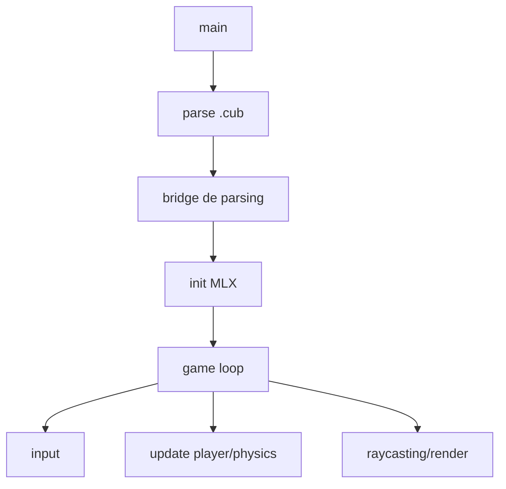

# cub3D

## 📖Overview

cub3D is a 3D graphics engine inspired by classic shooters like Wolfenstein 3D. This project introduces raycasting algorithms and real-time graphics programming, creating a dynamic 3D representation of a 2D maze from a first-person perspective. It combines mathematics, geometry, and rendering pipeline.


## 🎮Demo

<video src="docs/video/output.mp4" controls width="800"></video>

## ✨ Our implementation

Our approach has been to create a **solid and highly configurable graphics engine** that allows experimentation with how the engine works to render 3D images based on the suite of active configurations. Rendering modes, boost mode, frame display, environment physics, lighting, and player controls can all be customized using de MLX events. The goal is to appreciate in-game how different rendering modes affect engine performance and improve the user experience adn create a solid foundation for future additions such as sprites, animations, dynamic lighting, and more complex physics.

- ✅ **Map validation** ensuring proper maze structure and player positioning
- 🎯 **Real-time 3D rendering** using raycasting algorithms
- 🧱 **Textured walls** with support for different textures based on wall orientation (North, South, East, West)
- 🎨 **Customizable floor and ceiling colors**
- 🕹️ **Player movement** with WASD keys and mouse look
- 🗺️ **Minimap display** for navigation assistance
- 🧱 **Wall collision detection** to prevent walking through walls and ensure realistic movement
- 🖱️ **Mouse look** clapped to prevent unnatural rotations and configurable sensitivity
- 🔄 **Configurable rendering modes** for performance and visual quality adjustments
- 🖥️ **FPS display** and frame timing for performance monitoring
- 🏎️ **Boost mode** Performance optimizations with vectorized operations and memory management enhancements x2 FPS rate
- ⚙️ **Advanced physics system** including gravity and air deceleration
- 🌫️ **Atmospheric effects** with fog and desaturation shaders


## Requirements and Technologies

- Linux with X11 (Xlib, Xext, Xfixes) and zlib.
- `cc` and `make`.
- MiniLibX: a simple graphics library for window management and drawing, included as a submodule in this repository.
- Libft: self custom C library with utility functions, included in this repository.

## Installation

### Install dependencies (Ubuntu/Debian)

```bash
sudo apt-get update
sudo apt-get install gcc make xorg libxext-dev libbsd-dev libxfixes-dev
```

### Clone the Repository

```bash
git clone https://github.com/your-username/cube3D.git
cd cube3D
git submodule update --init --recursive
```

### Clone with Submodules (Alternative)

```bash
git clone --recurse-submodules https://github.com/your-username/cube3D.git
cd cube3D
```

### Build

```bash
make
```

## Usage

```bash
./cub3D assets/maps/good/self/performance.cub
```

## 🎮Controls and Graphics Engine Configuration

Controls are handled through keyboard and mouse events captured by the X11 library via MiniLibX, allowing real-time configuration of the graphics engine, frame display, physics behavior, and overall gameplay experience.

### 🕹️ Player Movement and Camera Control

| Key | Action |
|---|---|
| `W`, `A`, `S`, `D` | Move player |
| Arrow keys | Rotate camera / look up & down |
| `Left Shift` | Sprint |
| `Space` | Jump (physics enabled) |
| `Left Ctrl` | Crouch (physics enabled) |
| `Caps Lock` | Ground pound (physics enabled) |
| `Q` | Flight mode (physics enabled) |

### 🧰 Graphics Engine Configuration

| Key | Action |
|---|---|
| `O` | Raycasting on/off |
| `T` | Textures on/off |
| `F` | Fish-eye correction on/off (textures off) |
| `E` | Euclidean / perpendicular distance (textures off) |
| `C` | Boost render mode |

### 🖥️ Display & Mouse Settings

| Key | Action |
|---|---|
| `M` | Minimap on/off |
| `R` | Rays on minimap on/off |
| `+` / `-` | Minimap zoom in / out |
| `J` | Mouse control on/off |
| Mouse wheel | Adjust mouse sensitivity |
| `,` / `.` | Decrease / increase player volume |

### 🌦️Environment Settings

| Key | Action |
|---|---|
| `U` | Atmospheres on/off |
| `1` .. `4` | Select atmosphere |

### 🧪 Physics

| Key | Action |
|---|---|
| `P` | Physics system on/off |
| `K` | DukeDoom mode |
| `6` .. `0` | Gravity modes |

## Features

### Raycasting

- Proyeccion de muros con distancias perpendiculares.
- Correccion de fish-eye opcional.

### DDA Algorithm

- DDA para atravesar la rejilla y detectar colisiones eficientes.

# Boost mode y mejoras de rendimiento

## Microprocessor performance improvements

**Hot loops** are loops that execute **millions of times per second** in performance-critical code, such as graphics engines or real-time simulations (math, physics, statistical simulations, economic simulations, machine learning engines, database engines). Because they run so frequently, **every CPU cycle counts**, and small inefficiencies (cache misses, misaligned memory, unpredictable branches) can drastically reduce overall performance. Optimizing hot loops with techniques like **SIMD, vectorization, memory alignment, and loop unrolling** is essential to maximize throughput and minimize latency.

When rendering an image, there are certain functions that are called **once per pixel**. For example, in a window of **1280 × 720 pixels**, a function would be called around **900,000 times per frame**. These highly-repeated loops are called **hot loops**.

Because modern CPUs run at **several gigahertz**, even small inefficiencies—like cache misses, misaligned memory, or unpredictable branches—can add up to **millions of wasted cycles per frame**. Optimizing hot loops with techniques like **SIMD, vectorization, memory alignment, and loop unrolling** is essential to maximize throughput and keep frame rates high.


### ❌ Things to Avoid in hoot loops

| Optimization | Description |
|--------------|-------------|
| Pointer indirections | Causes cache misses, breaks prefetching, increases RAM latency |
| Frequent cache misses | Reduce throughput, fill pipelines with NOPs, cause stalls |
| `if` statements in hot loops | Unpredictable branches can hurt branch prediction and pipeline efficiency; deterministic input may still be OK |
| Function pointers | Increase call overhead and cache misses; worse than deterministic `if`s |
| Misaligned multiplications | Misaligned memory accesses → inefficient, more cache misses, reduces vectorization |
| Function calls | Stack/register overhead, breaks pipeline optimization, reduces vectorization |
| Calls saturating the I-cache | Many scattered instructions → lower throughput, I-cache pressure |
| Heavy divisions and multiplications | Slow operations → may stall hot loops |


### ✅ Things to Encourage in hoot loops

| Optimization | Description |
|--------------|-------------|
| Memory alignment | Enables contiguous and predictable access, reduces cache misses, supports SIMD and vectorization |
| Contiguous memory / Struct of Arrays (SoA) | Facilitates prefetching, efficient cache line loading, enables SIMD and vectorization |
| Prefetching | Brings data into cache ahead of time, keeps pipeline full, supports vectorization and SIMD |
| SIMD | Processes multiple data elements per instruction, increases throughput, requires aligned and contiguous data |
| Vectorization | Converts scalar operations into block operations, depends on alignment, contiguity, and prefetching |
| Loop unrolling | Reduces loop control overhead, allows SIMD/vectorization to be more effective |
| Use of registers and local variables | Reduces memory accesses, keeps data close to the CPU, accelerates hot loops and vectorization |
| Microprocessor performance improvements | Takes advantage of modern CPU enhancements like larger caches, better branch prediction, higher clock speeds, and SIMD/vector units |


## Memory Fill Optimizations
Instead of writing memory one byte at a time, this implementation fills memory using larger blocks whenever possible. The idea is simple: modern CPUs are much faster when writing aligned, contiguous chunks of memory that match cache lines and pages. By aligning the destination pointer, expanding the fill value into larger patterns, and writing memory in progressively smaller blocks only when needed, this approach reduces the number of write operations and allows the CPU and cache system to work more efficiently.

| Optimization | Description |
| --- | --- |
| Memory alignment | Aligns the destination pointer to 64-byte cache line boundaries to avoid unaligned writes and cache penalties. |
| Pattern expansion | Expands the input `int` value into `long` and `long long` patterns to write multiple bytes per instruction. |
| Large block writes | Fills memory using the largest possible blocks first (4 KB pages, 64-bit, 32-bit, then bytes). |
| Loop unrolling | Unrolls inner loops to reduce branching overhead and improve instruction-level parallelism. |
| Cache & TLB efficiency | Page-sized writes improve cache utilization and reduce TLB misses. |
| Linear control flow | Uses a single iterative flow to minimize function calls and branch mispredictions. |
| Tail handling | Handles remaining bytes with progressively smaller writes to ensure correctness. |

# Game engine arqhitecture

In a professional graphics engine, separating **simulation** from **rendering** is not just a performance optimization—it is a **structural design decision**. The simulation is responsible for updating the world state—positions, object states, collisions, visibility, rules, and timing—while the renderer does not make decisions; it simply **represents an already-resolved state**. This separation ensures that the engine's logic is **coherent, predictable, and completely independent of how it is drawn on screen**.

This division allows the simulation to be **deterministic and stable**. The simulation can run with a **fixed timestep**, always produce the same results, and remain **independent of framerate or GPU hardware**. The renderer, on the other hand, can run at a different speed, interpolate, or even skip frames without affecting the world state. This is **crucial for physics, replays, networking, and any system that requires reproducibility**.

Separating simulation and rendering is also the foundation of **parallelism in modern engines**. Each simulation system—**logic, physics, animations, AI, environment**—can execute as independent tasks within **job systems or task graphs**, while rendering runs on another thread or prepares commands for the GPU. With well-defined data flows, the engine can **scale with the number of cores, reduce blocking, and leverage multicore architectures** without introducing fragile dependencies.

Finally, this modularization reduces **coupling and maintenance cost**. The renderer can change API, backend, or visual style without touching game logic, and the simulation can grow in complexity without destabilizing the rendering code. This is what allows the addition of **new systems**—more complex animations, wind, environmental effects, sprites, or advanced AI—while keeping the engine **organized, scalable, and maintainable in the long term**.


### Minimap

- Minimap escalable con zoom y rayos opcionales.

### Mouse

- Rotacion por mouse con sensibilidad configurable.


## Physics System

The physics system manages movement and object interactions within the game world through a discrete real-time simulation. It is responsible for updating positions based on velocities and accelerations, resolving collisions, and applying constraints, fully decoupling movement logic from the rendering system.  
Its goal is to ensure **consistent, stable, and controllable behavior**, independent of framerate or hardware, making the system **deterministic**.

### Features

- **2D Plane Acceleration and Deceleration**  
  Movement is no longer instantaneous and responds to forces.  
  Enabled via *physics mode*, activated with **P**.

- **Per-Axis Differential Acceleration and Deceleration**  
  Allows interaction with external factors such as wind, explosions, or impacts, and corrects **strafing** by applying independent forces per axis.  
  Activated with **K** when physics mode is enabled.

- **Camera Movement Simulation on the Z Axis**  
  Includes configurable acceleration and gravity, with multiple behavior profiles mapped to number keys **6–0**:

| Key | Gravity Mode      | Description                               |
|-----|-----------------|-------------------------------------------|
| 6   | Ground (default) | Standard earth gravity                     |
| 7   | Moon             | Low gravity                                |
| 8   | Jupiter          | High gravity                               |
| 9   | Spectre          | Slight ascent when jumping, low vertical movement |
| 0   | Jetpack          | Gravity + jetpack assist                   |

- **Jump Direction Preservation**  
  When jumping, the initial movement direction is preserved, and progressive deceleration is applied on the 2D plane while airborne, simulating coherent parabolic motion.

- **Flight Mode**  
  Enables free movement across all three axes.  
  Activated with **K**.

- **Crouch Mode**  
  Reduces camera height and adjusts movement behavior.  
  Activated with **Control**.

- **Prone Mode**  
  Simulates a fully horizontal position, modifying both camera and collision behavior.  
  Activated with **TAB**.

### Pending Features

- **Head Bobbing**  
  Optional and configurable camera oscillation while moving, intended to enhance the sense of motion and immersion.


### Ambientes

- Presets con configuraciones de color y shaders.

## Arquitectura y diagramas de flujo de codigo

### Flujo general



### Pipeline de render


## Galeria de disenos

Agrega imagenes en `docs/image/` y enlazalas aqui.

## Futuras mejoras e implementaciones

- Sistema de sprites y animaciones.
- Iluminacion dinamica por distancia.
- IA basica y entidades interactivas.
- Exportador/validador de mapas.

## Resources

- https://lodev.org/cgtutor/raycasting.html
- https://en.wikipedia.org/wiki/Digital_differential_analyzer_(graphics_algorithm)
- https://harm-smits.github.io/42docs/libs/minilibx


